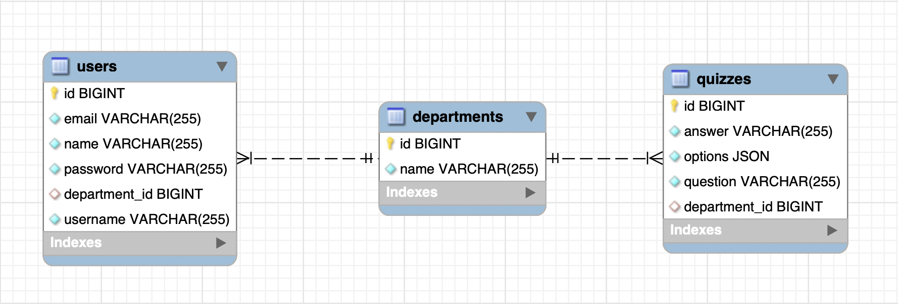

# Quiz App - Spring Boot 3 + Spring Data JPA + Spring Security
Quiz App (backend) using Spring Boot + MySQL + JWT Authentication

## APIs
1. Auth:
    - Create user: `/api/auth/create-user`
    - Login: `/api/auth/login`
2. Department - CRUD - `/api/departments`
3. Users - CRUD - `/api/users`
4. Quizzes - CRUD - `/api/quizzes`

## ER Diagram
